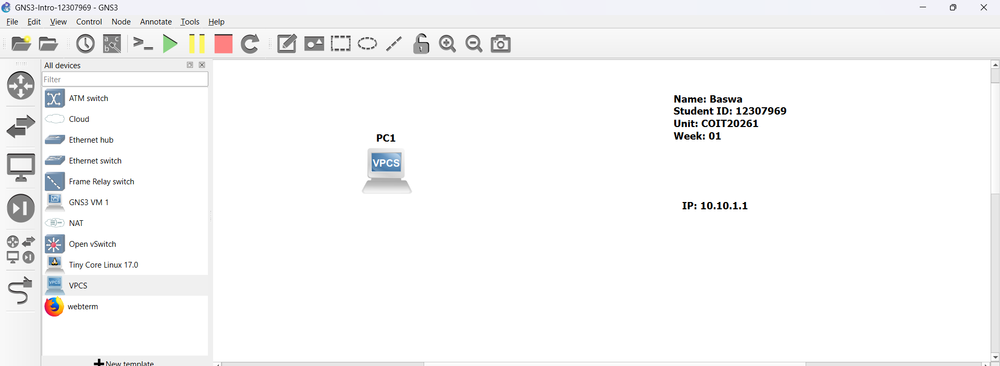
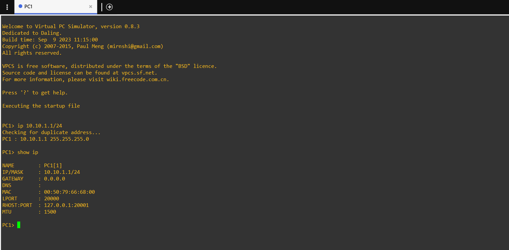

# Week 01 – GNS3 Introduction and Basic IP Configuration

## Student Details

* Name: Baswa
* Student ID: 12307969
* Unit: COIT20261 – Network Services and Automation
* Week: 01

---

## Aim

The aim of this task is to understand the basic working of GNS3 by creating a simple network, configuring a static IP address on a host, and verifying the configuration using command-line tools.

---

## Network Topology

A simple network was created using a single VPCS (Virtual PC Simulator) node in GNS3. This represents a basic end device in a network environment.

The topology contains one PC (PC1) with a manually assigned IP address. Text annotations were added to display student details and IP information, making the setup clear and professional.

---

## Configuration Steps

1. Opened GNS3 and created a new project named GNS3-Intro-12307969.
2. Added one VPCS node (PC1) into the workspace.
3. Added text labels showing Name, Student ID, Unit, and IP address.
4. Started the node using the start button.
5. Opened the console of the node.
6. Assigned a static IP address using the command:
   ip 10.10.1.1/24
7. Verified the IP configuration using:
   show ip

---

## Commands Used

ip 10.10.1.1/24
show ip

---

## Testing Results

The output shows:

* IP Address: 10.10.1.1/24
* Subnet Mask: 255.255.255.0
* Gateway: 0.0.0.0

This confirms that the IP address was successfully configured on the host. Since there is no router in the network, the gateway is not required.

---

## Analysis and Explanation

In this task, a static IP address was manually assigned to the host. Static IP addressing ensures that the device keeps the same IP address every time, which is important for testing and controlled environments.

The /24 subnet mask means that the first 24 bits represent the network and the remaining bits are used for host addresses. This allows multiple devices to exist in the same network range.

Unlike DHCP, which assigns IP addresses automatically, static configuration provides full control and avoids unexpected changes. This is especially useful in lab setups and troubleshooting.

No gateway was configured because the network contains only one device and no communication with other networks is required.

---

## Key Concepts Learned

* Static IP addressing
* Subnet mask and CIDR notation (/24)
* Difference between static and dynamic IP
* Basic use of VPCS in GNS3
* Importance of correct device selection

---

## Reflection

This task helped me understand the basic concept of IP addressing in a practical way. Initially, I faced confusion while using TinyCoreLinux because the configuration method was different. After switching to VPCS, the process became simple and clear.

I learned that choosing the correct device is important in GNS3. I also understood how to verify network configurations using commands. This task improved my confidence in working with GNS3 and basic networking concepts.

---

## Conclusion

The task was successfully completed by creating a simple network, assigning a static IP address, and verifying it using commands. This activity provided a strong foundation for future networking tasks in this unit.
