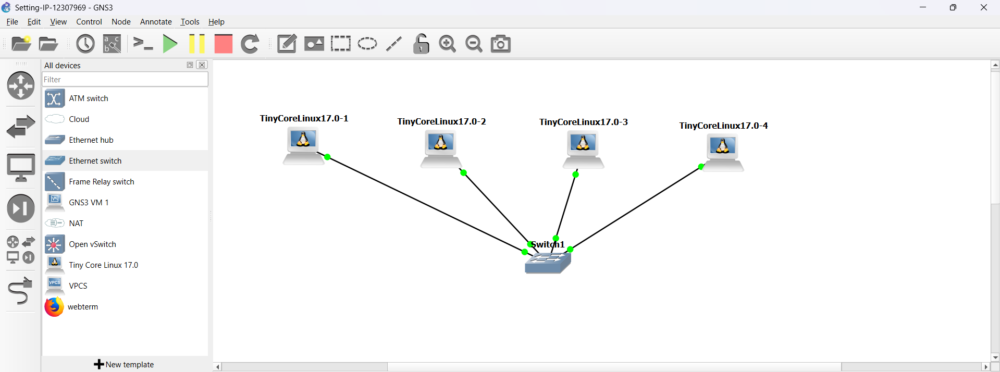
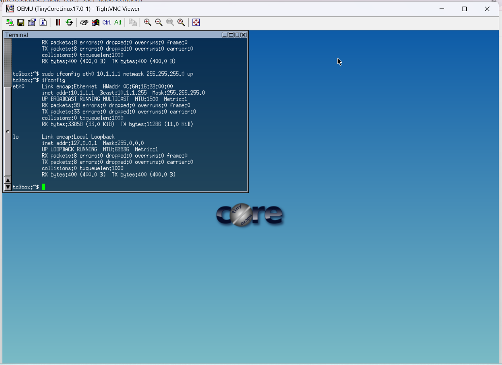
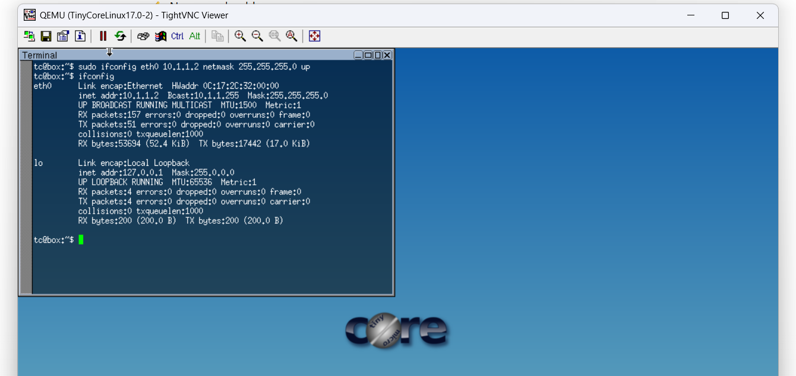
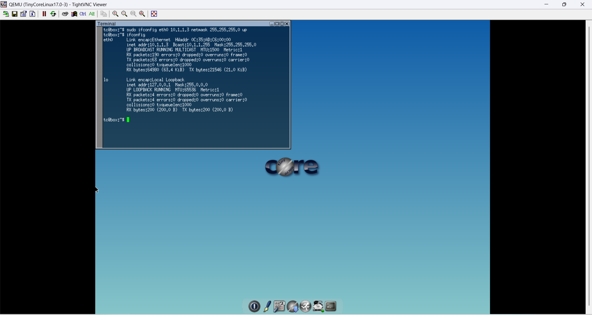
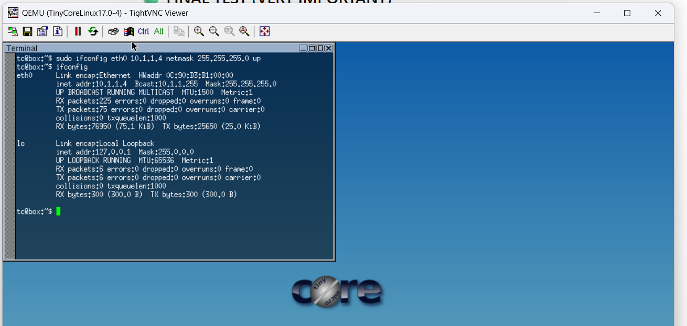
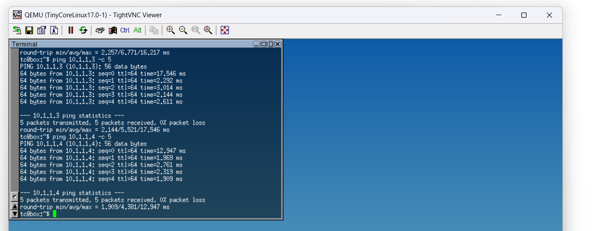

# Week 02 – Static IP Configuration and Network Connectivity Testing

## Student Details

* Name: Baswa
* Student ID: 12307969
* Unit: COIT20261 – Network Services and Automation
* Week: 02

---

## Aim

The aim of this task is to configure static IP addresses using different methods on multiple hosts in a LAN environment and to test network connectivity and delay using ping commands.

---

## Network Topology

A LAN network was created using four Linux hosts connected to a single Ethernet switch in GNS3.



Each host was assigned an IP address within the same subnet (10.1.1.0/24) to enable communication between devices.

---

## IP Addressing Plan

| Host   | IP Address | Subnet Mask   |
| ------ | ---------- | ------------- |
| Host 1 | 10.1.1.1   | 255.255.255.0 |
| Host 2 | 10.1.1.2   | 255.255.255.0 |
| Host 3 | 10.1.1.3   | 255.255.255.0 |
| Host 4 | 10.1.1.4   | 255.255.255.0 |

---

## Configuration Methods

### Method 1: Using /etc/network/interfaces (GNS3 Configure)

For Host 1 and Host 2, static IP addresses were configured using the network configuration file before starting the nodes.

Configuration:

```
auto eth0
iface eth0 inet static
   address 10.1.1.1
   netmask 255.255.255.0
```

This method ensures that the IP configuration is persistent even after reboot.

---

### Method 2: Editing Interfaces File via Terminal

For Host 3, the configuration file was edited manually in the terminal:

```
sudo nano /etc/network/interfaces
```

Then applied using:

```
ifdown eth0
ifup eth0
```

This method also provides persistent configuration but requires manual reload of the interface.

---

### Method 3: Using ip Command

For Host 4, the IP address was assigned using:

```
ip address add 10.1.1.4/24 dev eth0
```

This method applies the IP address immediately but is temporary and will be lost after reboot.

---

## Commands Used

```
ifconfig eth0 10.1.1.X netmask 255.255.255.0 up
ip address add 10.1.1.4/24 dev eth0
ip address show
ping 10.1.1.X
ping -c 5 10.1.1.X
```

---

## Verification of IP Configuration






All hosts successfully displayed their assigned IP addresses using the `ifconfig` command, confirming correct configuration.

---

## Connectivity Testing

### 1. Basic Ping Test



The ping results show successful communication between hosts with 0% packet loss, confirming that all devices are reachable within the LAN.

---

### 2. Ping to Invalid IP


When pinging a non-existing IP address, no replies were received, and packet loss was observed. This confirms proper network behavior when a destination is unreachable.

---

### 3. Ping with Options


Different ping options were tested:

* `-c` to limit number of packets
* `-i` to control interval
* `-s` to modify packet size

These options help analyze network performance under different conditions.

---

## Analysis and Explanation

This task demonstrated how IP configuration can be performed using multiple methods in Linux systems. The `/etc/network/interfaces` method provides permanent configuration, making it suitable for stable environments. In contrast, the `ip address add` command is temporary and mainly used for quick testing.

The successful ping results indicate that all hosts are within the same subnet and can communicate directly through the switch. The RTT (Round Trip Time) values observed in the ping output provide insight into network delay, which remained low due to the local environment.

Packet loss observed during invalid ping tests confirms that the network correctly identifies unreachable destinations.

---

## Key Concepts Learned

* Static IP configuration methods in Linux
* Difference between persistent and temporary IP assignment
* LAN communication using switches
* Ping command usage and options
* RTT and packet loss analysis

---

## Reflection

This task improved my understanding of IP configuration techniques and network communication. Initially, I configured all hosts using the same method, but later understood the importance of using different methods as required by the task.

I learned how different configuration approaches affect persistence and system behavior. The ping tests helped me understand how connectivity and delay are measured in networks.

Overall, this task strengthened my practical networking skills and improved my confidence in using GNS3 for real-world scenarios.

---

## Conclusion

The task was successfully completed by configuring static IP addresses using different methods and testing network connectivity. The results confirmed correct configuration and communication between hosts, providing a strong foundation for future networking tasks.
