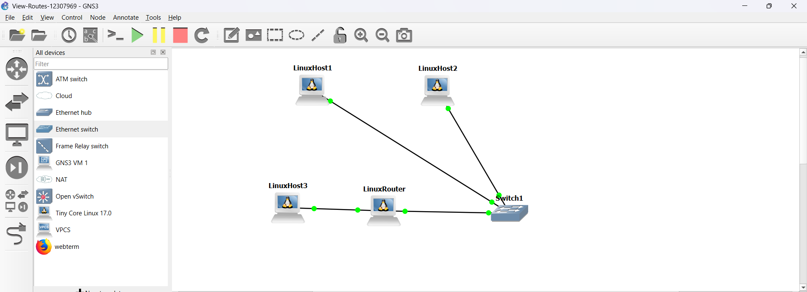
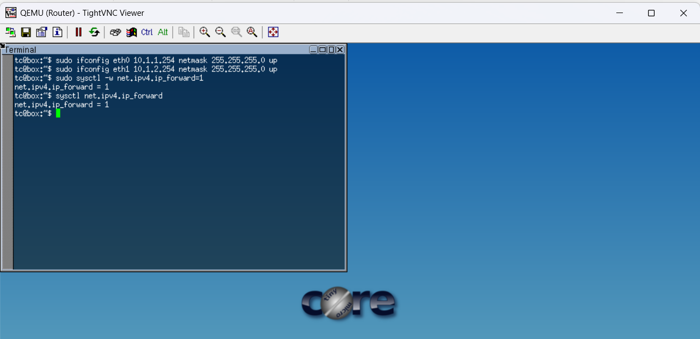
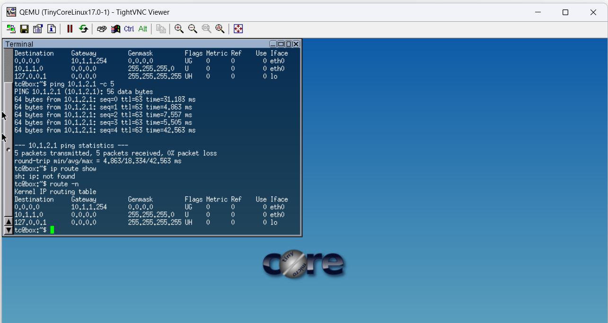

# Week 04 – Routing Tables and Dynamic Routing (OSPF)

## Student Details

* Name: Baswa
* Student ID: 12307969
* Unit: COIT20261 – Network Services and Automation
* Week: 04

---

# Part A – Static Routing and Routing Table Analysis

## Aim

The aim of this task is to understand how routing works between different subnets using a router, configure IP addressing, enable packet forwarding, and analyze routing tables.

---

## Network Topology

A network was designed with three Linux hosts, one Linux router, and one Ethernet switch. The network is divided into two subnets connected through the router.



---

## Network Design

### Subnet 1: 10.1.1.0/24

* Host1 → 10.1.1.1
* Host2 → 10.1.1.2
* Router (eth0) → 10.1.1.254

### Subnet 2: 10.1.2.0/24

* Host3 → 10.1.2.1
* Router (eth1) → 10.1.2.254

This design allows communication between two separate networks using a router.

---

## Configuration

### Host Configuration Example

```id="h1cfg"
auto eth0
iface eth0 inet static
   address 10.1.1.1
   netmask 255.255.255.0
   gateway 10.1.1.254
   up sysctl net.ipv4.ip_forward=0
```

All hosts were configured similarly with appropriate IP addresses and gateways.

---

### Router Configuration

```id="routercfg"
auto eth0
iface eth0 inet static
   address 10.1.1.254
   netmask 255.255.255.0

auto eth1
iface eth1 inet static
   address 10.1.2.254
   netmask 255.255.255.0

up sysctl net.ipv4.ip_forward=1
```

The router connects both subnets and enables packet forwarding.

---

## Forwarding Verification

Command used:

```id="fwcmd"
sysctl net.ipv4.ip_forward
```

* Router → Output = 1 (Enabled)
* Hosts → Output = 0 (Disabled)

This confirms correct routing behavior.

---

## Routing Table Analysis

Command used:

```id="routecmd"
ip route show
```

### Host Routing Table

* Default route via gateway
* Local subnet route

### Router Routing Table

* Route to 10.1.1.0/24 via eth0
* Route to 10.1.2.0/24 via eth1



This shows that the router knows how to reach both networks.

---

## Connectivity Testing

Command:

```id="pingcmd"
ping 10.1.2.1
```



Result:

* Successful communication between subnets
* 0% packet loss

This confirms correct routing and configuration.

---

## Analysis

This task demonstrates how routing enables communication between different subnets. Without a router, devices in separate networks cannot communicate. The router forwards packets based on routing tables.

The gateway configured in hosts directs traffic to the router when the destination is outside the local subnet. Enabling IP forwarding on the router is essential, as it allows the device to behave like a network-layer device.

Routing tables contain destination networks and next-hop information, which determines how packets travel through the network.

---

## Key Concepts Learned

* Static IP configuration
* Subnetting and network separation
* Role of router and gateway
* IP forwarding mechanism
* Routing table interpretation

---

## Reflection

This task improved my understanding of how networks communicate across subnets. I learned how to configure a router and understand its role in forwarding packets. Initially, understanding routing tables was challenging, but after testing with ping and observing outputs, it became clear how packets are routed.

---

## Conclusion

The task was successfully completed by creating a multi-subnet network, configuring routing, and verifying communication. This provides a strong foundation for understanding real-world networking systems.

---

# Part B – Dynamic Routing with OSPF

## 1. Aim  
The aim of this task is to observe how dynamic routing using OSPF is configured and how it automatically adapts to changes in the network. This includes analysing routing tables, identifying neighbour relationships, and verifying how traffic is redirected when a link fails.

---

## 2. Network Topology  
The network consists of two hosts and four routers configured with OSPF. The topology provides two possible paths between the hosts, allowing dynamic routing decisions.

- Path 1: FRR1 → FRR2 → FRR4  
- Path 2: FRR1 → FRR2 → FRR3 → FRR4  

### Screenshot  
 

---

## 3. Project Setup  

The OSPF template project was used and duplicated as:

```
OSPF-Basics-12313659.gns3project
```

All nodes were started in GNS3, and sufficient time was given for the routers to fully boot. Each router displayed the `frr#` prompt, confirming that FRRouting (FRR) was running successfully.

No manual configuration of IP addresses or OSPF was required, as the template network was preconfigured.

---

## 4. Viewing OSPF Routing Information  

The FRR CLI was accessed using:

```bash
vtysh
```

The following commands were used to analyse routing behaviour:

### 4.1 OSPF Neighbours  

```bash
show ip ospf neighbor
```

This command displayed:
- Neighbour router IP addresses  
- Adjacency states (FULL)  
- Interface connections  

This confirms that OSPF neighbour relationships were successfully established.

---

### 4.2 OSPF Routes  

```bash
show ip ospf route
```

This command showed:
- Networks learned dynamically via OSPF  
- Route metrics (cost)  
- Next-hop routers  

---

### 4.3 Routing Table  

```bash
show ip route
```

This displayed:
- Complete routing table  
- OSPF routes marked with "O"  
- Directly connected networks  

---

## 5. Routing Table Analysis  

The routing tables showed that routers dynamically learned paths to remote networks.

### Summary Table  

| Router | Destination Network | Next Hop |
|--------|-------------------|----------|
| FRR1 | Host2 Network | FRR2 |
| FRR2 | Host2 Network | FRR4 |
| FRR3 | Host1 Network | FRR2 |
| FRR4 | Host1 Network | FRR2 |

This confirms that OSPF selects the best available path based on network topology and metrics.

---

## 6. Path Testing (Before Failure)  

Traceroute was executed from Host1 to Host2:

```bash
traceroute 10.0.6.2
```

### Observed Path  

```
Host1 → FRR1 → FRR2 → FRR4 → Host2
```

This indicates that OSPF selected the shortest or lowest-cost path (top path).


---

## 7. Link Failure Simulation  

To test OSPF adaptability, the link between FRR2 and FRR4 was disconnected by stopping the corresponding NETem node. This removed the primary path between the hosts.

---

## 8. Path Testing (After Failure)  

Traceroute was executed again:

```bash
traceroute 10.0.6.2
```

### Observed Path  

```
Host1 → FRR1 → FRR2 → FRR3 → FRR4 → Host2
```

This demonstrates that:
- OSPF detected the link failure  
- Routing tables were updated automatically  
- Traffic was redirected through the alternate path  

---

## 9. Observations  

- OSPF automatically discovers neighbouring routers  
- Routing tables are dynamically updated  
- Multiple paths exist between source and destination  
- Failover occurs without manual intervention  
- Network communication remains uninterrupted after link failure  

---

## 10. Conclusion  

This task successfully demonstrated the working of dynamic routing using OSPF. The routers dynamically learned routes and selected the most efficient path for communication. When a link failure occurred, OSPF automatically recalculated routes and redirected traffic through an alternate path. This highlights the importance of dynamic routing protocols in maintaining reliable and efficient network communication.

---

