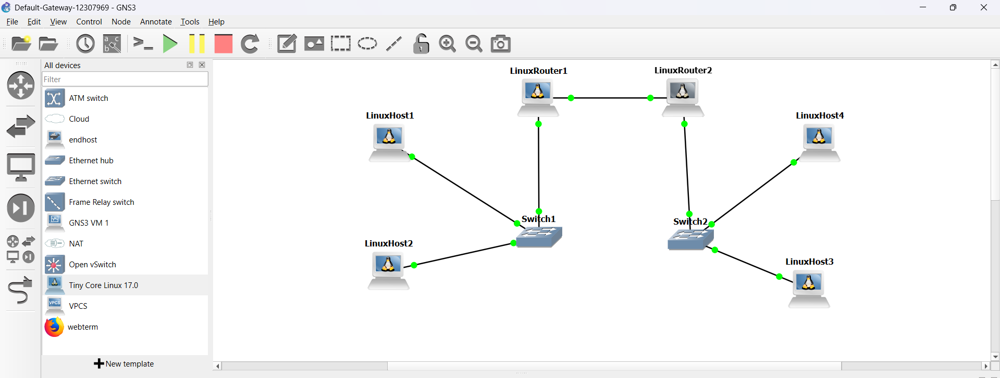
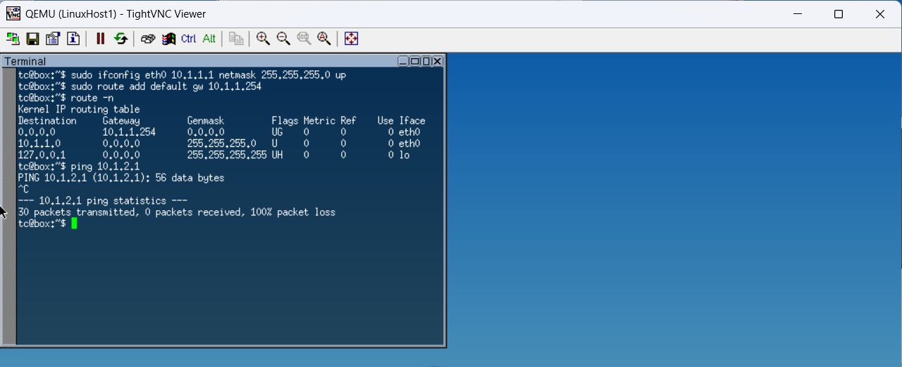
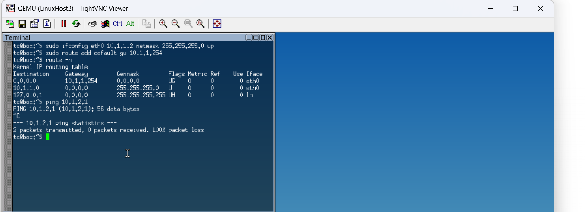
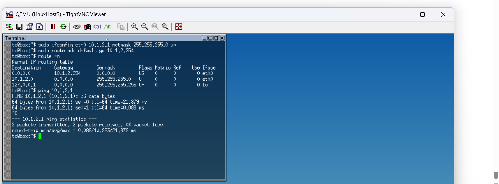
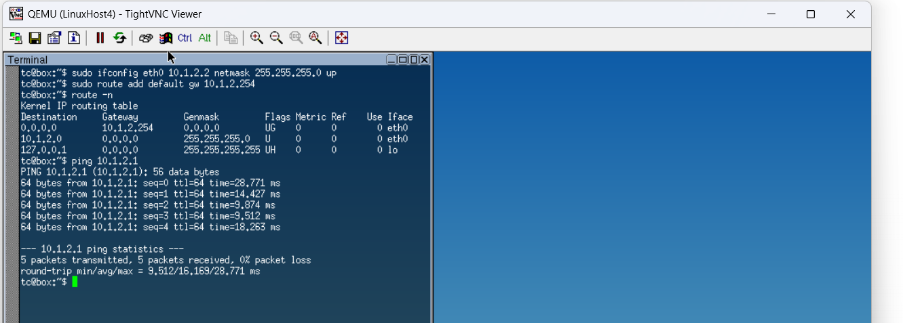
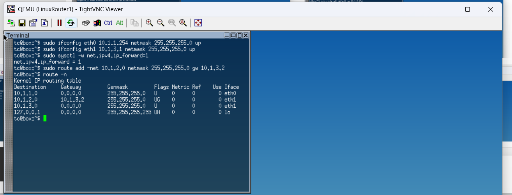
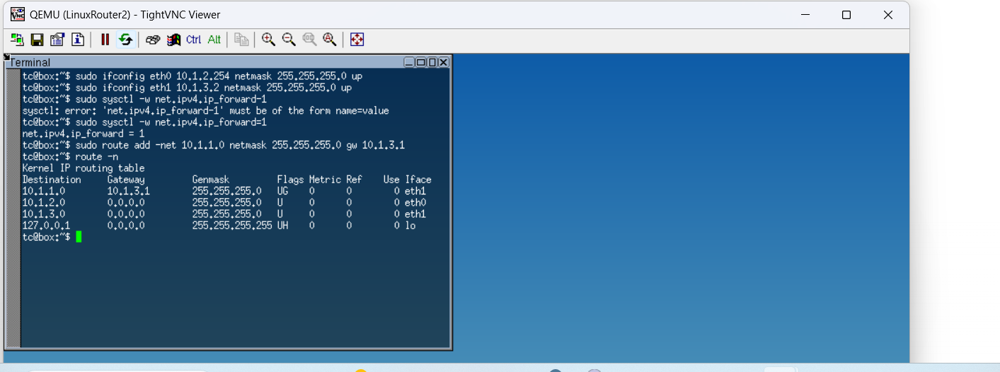

# Week 06 – Default Gateway and Inter-Subnet Routing

#  Task 1: Resolving IP Addresses to Hardware Addresses (ARP)

## Aim

The aim of this task is to understand how the Address Resolution Protocol (ARP) works in a Local Area Network (LAN) by mapping IP addresses to hardware (MAC) addresses and observing how the ARP table changes during communication.

---

## Network Setup

The network consists of four Linux hosts connected through a single Ethernet switch. All hosts are configured within the same subnet, allowing direct communication without the need for routing.

---

## Initial Condition

Before any communication occurs:

* Each host has an IP address assigned
* No prior communication between hosts has taken place
* ARP tables are initially empty or contain very few entries

This state represents a fresh network where devices have not yet discovered each other.

---

## Step 1: Viewing the ARP Table

The ARP table of Host A is checked using:

```bash
arp -a
```

### Observation

* The ARP table is either empty or contains only limited entries
* No mapping exists for other hosts in the network

### Explanation

At this stage, Host A has not communicated with other devices, so it has no knowledge of their MAC addresses.

---

## Step 2: Ping from Host A to Host B

```bash
ping <HostB-IP>
```

### Observation

* The first ping may take slightly longer
* Subsequent pings become faster
* Communication between Host A and Host B is successful

### Explanation

When Host A sends a packet to Host B:

1. It checks its ARP table for Host B’s MAC address
2. If not found, it broadcasts an ARP request
3. Host B replies with its MAC address
4. Host A stores this mapping in its ARP table

---

## Step 3: View ARP Table After Ping

```bash
arp -a
```

### Observation

* A new entry appears in the ARP table
* The entry includes:

  * IP address of Host B
  * Corresponding MAC address
  * Interface used

### Example Representation

* IP → 192.168.x.x
* MAC → xx:xx:xx:xx:xx:xx

### Explanation

The ARP table is dynamically updated after communication, allowing faster future communication without broadcasting again.

---

## Step 4: Ping from Host C to Host A

```bash
ping <HostA-IP>
```

### Observation

* Communication is successful
* Host A receives packets from Host C

### Explanation

Host C performs ARP resolution to find Host A’s MAC address and sends data successfully.

---

## Step 5: View ARP Table Again on Host A

```bash
arp -a
```

### Observation

* Additional entries appear in the ARP table
* Now includes mapping for Host C as well

### Explanation

The ARP table is continuously updated as new devices communicate. Each interaction adds new IP-to-MAC mappings.

---

## ARP Table Behavior Analysis

* ARP entries are created dynamically
* Entries are stored temporarily
* If a host is inactive for some time, entries may expire
* Re-communication triggers ARP requests again

---

## Key Concepts

* ARP maps Layer 3 (IP) addresses to Layer 2 (MAC) addresses
* Communication in a LAN requires MAC address resolution
* ARP uses broadcast requests and unicast replies
* ARP tables improve efficiency by caching mappings

---

## Results

* Initial ARP table contained no relevant entries
* After communication, entries were dynamically added
* Multiple hosts resulted in multiple ARP mappings
* Communication triggered automatic ARP resolution

---

## Conclusion

This task demonstrated how ARP operates within a local network to resolve IP addresses into MAC addresses. Initially, no mappings existed, but once communication began, ARP dynamically updated the table with the required information. This process enables efficient communication within a LAN by avoiding repeated broadcasts and maintaining a cache of known devices. The experiment confirms that ARP is a fundamental protocol for network communication at the data link layer.

# Task 2: Default Gateways 

## Aim

The aim of this task is to configure default gateways and implement routing between multiple subnets using Linux routers. The objective is to enable communication between hosts located in different networks by correctly configuring IP addressing, gateways, and static routing.

---

## Network Topology



The network consists of:

* 4 Linux Hosts (PC1, PC2, PC3, PC4)
* 2 Linux Routers (Router1, Router2)
* 2 Switches

### Logical Design

* Subnet 1 → Connected to Router1
* Subnet 2 → Connected to Router2
* Subnet 3 → Router-to-Router link

---

## IP Addressing Scheme

### Subnet 1 (10.1.1.0/24)

* PC1 → 10.1.1.1
* PC2 → 10.1.1.2
* Router1 (eth0) → 10.1.1.254

### Subnet 2 (10.1.2.0/24)

* PC3 → 10.1.2.1
* PC4 → 10.1.2.2
* Router2 (eth0) → 10.1.2.254

### Subnet 3 (10.1.3.0/24)

* Router1 (eth1) → 10.1.3.1
* Router2 (eth1) → 10.1.3.2

---

## Configuration Process

### Step 1: Host Configuration

Each host was configured with an IP address and default gateway.

#### PC1



```bash
sudo ifconfig eth0 10.1.1.1 netmask 255.255.255.0 up
sudo route add default gw 10.1.1.254
route -n
```

#### PC2



```bash
sudo ifconfig eth0 10.1.1.2 netmask 255.255.255.0 up
sudo route add default gw 10.1.1.254
route -n
```

#### PC3



```bash
sudo ifconfig eth0 10.1.2.1 netmask 255.255.255.0 up
sudo route add default gw 10.1.2.254
route -n
```

#### PC4



```bash
sudo ifconfig eth0 10.1.2.2 netmask 255.255.255.0 up
sudo route add default gw 10.1.2.254
route -n
```

---

### Step 2: Router Configuration

#### Router1



```bash
sudo ifconfig eth0 10.1.1.254 netmask 255.255.255.0 up
sudo ifconfig eth1 10.1.3.1 netmask 255.255.255.0 up

sudo sysctl -w net.ipv4.ip_forward=1

sudo route add -net 10.1.2.0 netmask 255.255.255.0 gw 10.1.3.2
route -n
```

#### Router2



```bash
sudo ifconfig eth0 10.1.2.254 netmask 255.255.255.0 up
sudo ifconfig eth1 10.1.3.2 netmask 255.255.255.0 up

sudo sysctl -w net.ipv4.ip_forward=1

sudo route add -net 10.1.1.0 netmask 255.255.255.0 gw 10.1.3.1
route -n
```

---

## Connectivity Testing and Results

### Initial Testing (Before Full Routing)

#### PC1 Ping to Subnet 2


```bash
ping 10.1.2.1
```

**Result:**

* Request sent but no reply
* Network unreachable or packet loss observed

**Reason:**

* Routing between subnets was not fully configured

---

#### PC2 Ping Test


```bash
ping 10.1.2.1
```

**Result:**

* 100% packet loss

**Analysis:**

* No route to destination network

---

### Successful Testing (After Routing Configuration)

#### PC3 Communication


```bash
ping 10.1.2.1
```

**Result:**

* Successful replies received
* 0% packet loss

---

#### PC4 Communication


```bash
ping 10.1.2.1
```

**Result:**

* Stable communication
* Consistent response times

---

## Technical Analysis

* Default gateway allows hosts to send packets outside their local subnet
* Routers forward packets between different networks
* IP forwarding must be enabled for routing to work
* Static routes define the path to remote networks
* Without routing, inter-subnet communication fails

---

## Results Summary

| Test Case                         | Result     |
| --------------------------------- | ---------- |
| Same subnet communication         | Successful |
| Different subnet (before routing) | Failed     |
| Different subnet (after routing)  | Successful |
| Routing table verification        | Correct    |

---

## Conclusion

This task successfully demonstrated how default gateways and routers enable communication between multiple subnets. Initially, hosts were unable to communicate across networks due to missing routing configurations. After enabling IP forwarding and adding static routes, full connectivity was achieved. This experiment highlights the importance of routing mechanisms in network communication and clearly shows how routers act as the backbone of inter-network data transfer.
